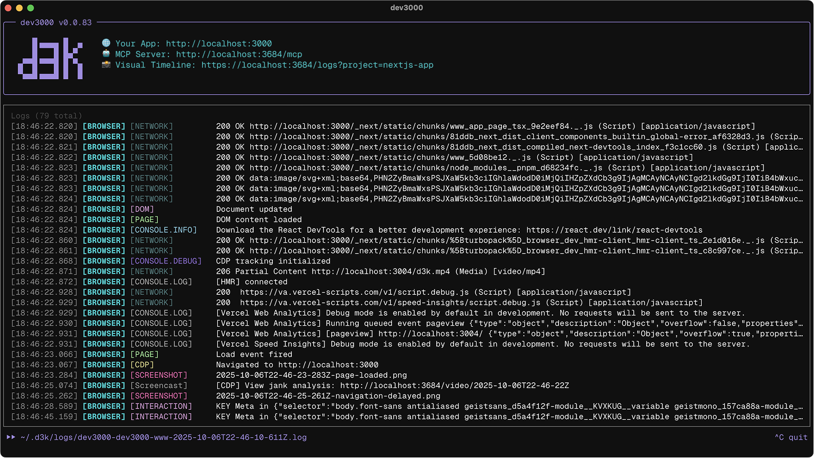

# dev3000



A debugging assistant that captures everything happening in your web app during development - server logs, browser events, network requests, and automatic screenshots - organized in a timeline that AI can understand.

## Quick Start

```bash
pnpm install -g dev3000
dev3000
```

Then tell Claude: "fix my app"

## Requirements

- Node.js >= v22.12.0 (required for Chrome DevTools Protocol support)

## What It Does

dev3000 runs your development server and monitors it in a headless browser, capturing:

- Server logs and console output
- Browser console messages and errors
- Network requests and responses
- Automatic screenshots (navigation, errors, interactions)
- User interactions (clicks, form submissions)

Everything is saved to timestamped logs that AI assistants can read to understand what went wrong and suggest fixes.

View the timeline at `http://localhost:3684/logs`


## How It Works

dev3000 provides an MCP server with debugging tools that Claude Code can use:

- **fix_my_app** - Analyzes logs, finds errors, suggests fixes
- **execute_browser_action** - Takes screenshots, clicks, navigates
- **restart_dev_server** - Restarts your server safely
- **crawl_app** - Discovers all routes in your app
- **find_component_source** - Maps DOM elements to source code

When you run dev3000 in a project with Next.js or if you have chrome-devtools MCP installed, it automatically integrates with those too.

## Installation & Setup

### Global Install (Recommended)

```bash
pnpm install -g dev3000
cd your-project
dev3000
```

### Local Install

```bash
pnpm add -D dev3000
pnpm dev3000
```

### Claude Code Setup

1. Start dev3000 in your project
2. Open Claude Code
3. Say "fix my app" or ask debugging questions

That's it. Claude automatically discovers the dev3000 MCP server and can read your logs.

## Options

```bash
dev3000 --help
```

Key options:
- `--port <number>` - Development server port (default: 3000)
- `--mcp-port <number>` - MCP server port (default: 3684)
- `--no-browser` - Skip browser monitoring
- `--playwright` - Use Playwright instead of Chrome extension

## AI Integration

dev3000 automatically integrates with:

- **Claude Code** - Works out of the box, no configuration needed
- **chrome-devtools MCP** - Advanced browser inspection when installed
- **nextjs-dev MCP** - Next.js-specific debugging when installed

The MCP server discovers available tools automatically and suggests them when relevant.

## Development Commands

```bash
# Run dev server locally
pnpm dev

# Build for production
pnpm build

# Run tests
pnpm test

# Lint code
pnpm lint
```

## Browser Options

### Chrome Extension (Default)

Automatically installs and manages a Chrome extension for monitoring. Best for most projects.

### Playwright Mode

```bash
dev3000 --playwright
```

Uses Playwright's browser automation. Better for:
- CI/CD environments
- Automated testing
- Projects that need precise browser control

The extension has some limitations (stricter security, no incognito mode support) but provides better real-world monitoring.

## Logs

Logs are stored in:
- `/var/log/dev3000/` (if writable)
- OS temp directory (fallback)

Each project gets its own log files, automatically rotated (keeps 10 most recent).

## Frequently Asked Questions

### Can I use this with Cursor, Windsurf, etc.?

Yes, but you'll need to manually configure the MCP server connection. See the [MCP documentation](https://modelcontextprotocol.io/docs/tools/clients) for your AI assistant.

### Does this work with non-Next.js projects?

Yes. dev3000 works with any web framework (React, Vue, Svelte, vanilla JS, Rails, Django, etc.). It just monitors your dev server and browser.

### What's the difference between the Chrome extension and Playwright?

The Chrome extension runs in a real browser instance for authentic monitoring. Playwright uses browser automation which is better for CI/CD but may behave slightly differently.

### How do I stop dev3000?

`Ctrl+C` or `Cmd+C` stops both dev3000 and your development server.

### Where are screenshots saved?

Screenshots are embedded in the log files and viewable in the web UI at `http://localhost:3684/logs`

## Contributing

We welcome contributions! Please see our [contributing guidelines](./CONTRIBUTING.md).

## License

MIT
