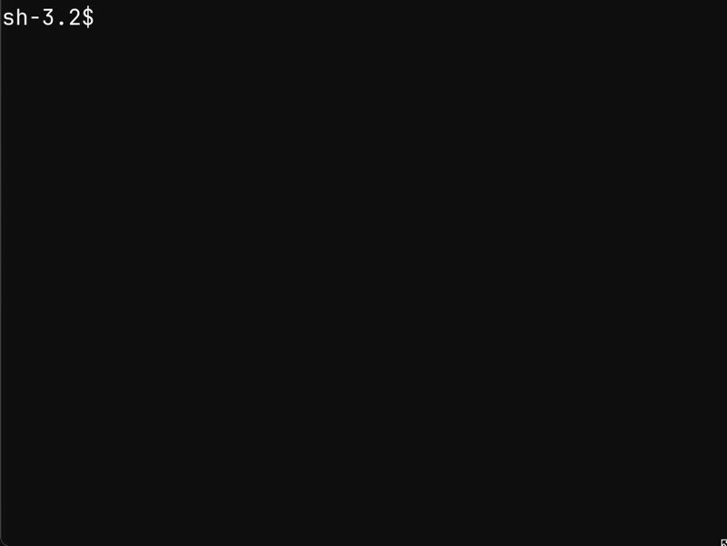
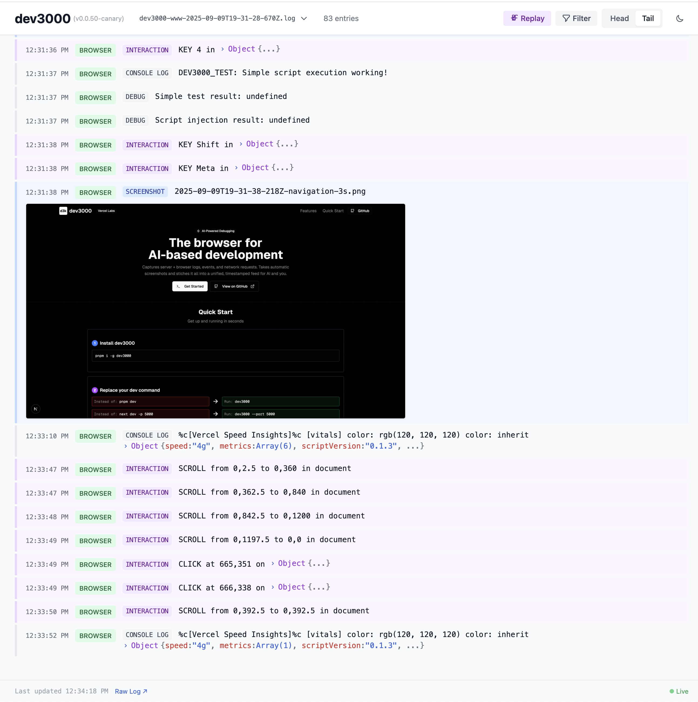

# dev3000

Captures your web app's complete development timeline - server logs, browser events, console messages, network requests, and automatic screenshots - in a unified, timestamped feed for AI debugging.

## Quick Start

```bash
pnpm install -g dev3000
dev3000
```



**You can also connect claude code to the mcp-server to have it issue commands to the browser.**

```bash
claude mcp add dev3000 http://localhost:3684/api/mcp/mcp
```

## What it does

Creates a comprehensive log of your development session that AI assistants can easily understand. When you have a bug or issue, Claude can see your server output, browser console, network requests, and screenshots all in chronological order.

The tool monitors your app in a real browser and captures:

- Server logs and console output
- Browser console messages and errors
- Network requests and responses
- Automatic screenshots on navigation, errors, and key events
- Visual timeline at `http://localhost:3684/logs`



## AI Integration

Give Claude your log file for instant debugging:

```
Read /tmp/d3k.log
```

Logs are automatically saved with timestamps in `/var/log/dev3000/` (or temp directory) and rotated to keep the 10 most recent per project. The current session is always symlinked to `/tmp/d3k.log` for easy access.

Or use the MCP server at `http://localhost:3684/api/mcp/mcp` for advanced querying:

- `read_consolidated_logs` - Get recent logs with filtering
- `search_logs` - Regex search with context
- `get_browser_errors` - Extract browser errors by time period
- `execute_browser_action` - Control the browser (click, navigate, screenshot, evaluate, scroll, type)

### MCP Integration Notes

**Cursor Compatibility**: If registering the MCP server directly in Cursor shows "no tools or prompts", first register it with Claude, then it will work in both applications. This is a known Cursor MCP integration issue.

## Using the Chrome Extension vs Playwright

dev3000 supports two monitoring modes:

### Default: Playwright Browser Automation

By default, dev3000 launches a Playwright-controlled Chrome instance for comprehensive monitoring.

### Alternative: Chrome Extension

For a lighter approach, install the dev3000 Chrome extension to monitor your existing browser session.

#### Installing the Chrome Extension

Since the extension isn't published to the Chrome Web Store, install it locally:

1. Open Chrome and navigate to `chrome://extensions/`
2. Enable "Developer mode" (toggle in top-right corner)
3. Click "Load unpacked"
4. Navigate to your dev3000 installation directory and select the `chrome-extension` folder
5. The extension will now monitor localhost tabs automatically

#### Using with --servers-only

When using the Chrome extension, start dev3000 with the `--servers-only` flag to skip Playwright:

```bash
dev3000 --servers-only
```

#### Comparison

| Feature             | Playwright (Default)     | Chrome Extension        |
| ------------------- | ------------------------ | ----------------------- |
| **Setup**           | Automatic                | Manual install required |
| **Performance**     | Higher resource usage    | Lightweight             |
| **Browser Control** | Full automation support  | Monitoring only         |
| **User Experience** | Separate browser window  | Your existing browser   |
| **Screenshots**     | Automatic on events      | Manual via extension    |
| **Best For**        | Automated testing, CI/CD | Development debugging   |

## Options

```bash
dev3000 [options]

  -p, --port <port>         Your app's port (default: 3000)
  --mcp-port <port>         MCP server port (default: 3684)
  -s, --script <script>     Package.json script to run (default: dev)
  --servers-only            Run servers only, skip browser launch (use with Chrome extension)
  --profile-dir <dir>       Chrome profile directory (default: /tmp/dev3000-chrome-profile)
```

Examples:

```bash
# Custom port
dev3000 --port 5173

# Use with Chrome extension (no Playwright)
dev3000 --servers-only

# Custom profile directory
dev3000 --profile-dir ./chrome-profile
```

---

_Made by [elsigh](https://github.com/elsigh)_

## Contributing

We welcome pull requests (PRs) from the community!

Before submitting a PR:

- **Pull the latest changes** from `main`.
- **Run** `scripts/canary.sh` to test your feature locally and verify what is already in the canary build.
- **Tip** `dev3000 --version` to verify you're on the canary locally
- **FYI** .husky/pre-commit.sh runs `pnpm format` to apply biome.json rules to all code
- Please run and test the canary build locally to avoid duplicating work that may already be done.
